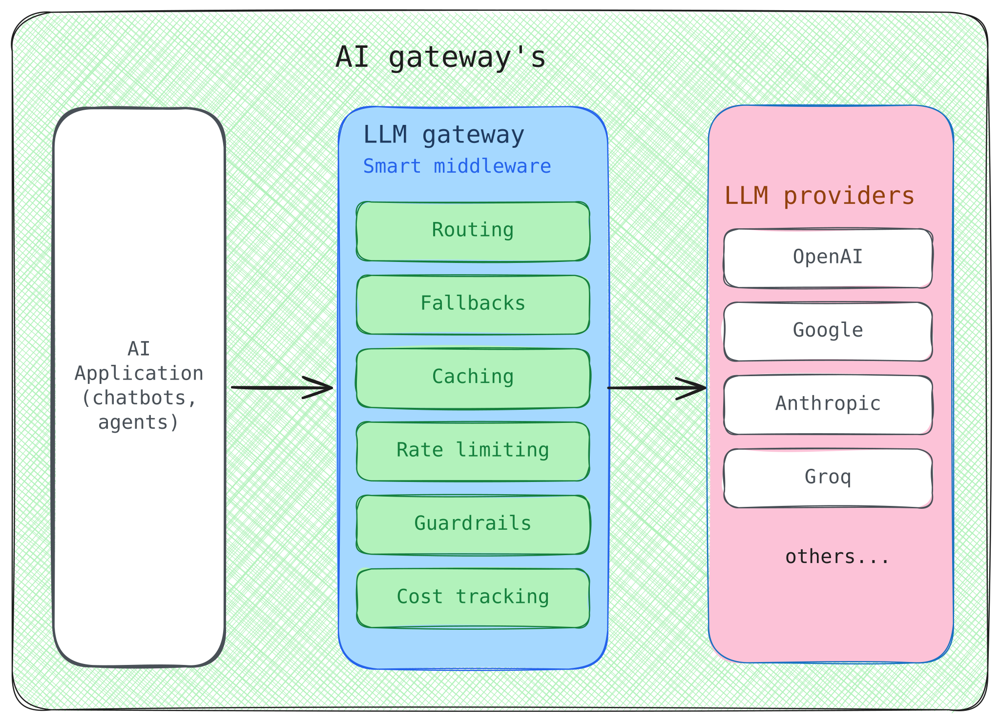

# **LLM and AI Gateways: Introduction and Research**

# **1. What an LLM gateway actually is**

**Short definition**

An LLM gateway is a piece of infrastructure that sits between your application and the model providers (OpenAI, Anthropic, AWS Bedrock, Google Vertex, Groq, Mistral, and so on). It speaks the OpenAI API format on one side and translates to every provider on the other.



**Why it exists**

Every provider has a different SDK, a different auth scheme, a different streaming protocol, different rate limits, and a different failure mode. If you call all of them directly from your application, you write the same glue five times and you still have no observability, no budgets, no failover, and no guardrails.

A gateway gives you one endpoint, one key format, one place to enforce policy, and one place to look when something goes wrong.

**How it works in one sentence**

Your app sends a normal OpenAI format request to the gateway. The gateway checks auth and budget, looks up cache, picks a target provider, translates the request, forwards it, translates the response back, logs the spend, and returns the result.

# **2. The five core jobs**

Every gateway does some subset of these five things. If a tool does none of them, it is not a gateway.

1. **Normalize** request and response formats across providers
2. **Route** each request, by cost, latency, quality, region, or team
3. **Enforce policy**, including rate limits, budgets, virtual keys, and role based access control
4. **Cache** responses, both exact match and semantic similarity
5. **Emit telemetry**, meaning logs, traces, cost attribution, and dashboards

When you evaluate a gateway, ask which of these five it does well, which it does poorly, and which it does not do at all.

# **3. Gateway versus framework**

A common confusion is mixing up an LLM gateway with LangChain, LlamaIndex, Haystack, or the Vercel AI SDK. They live in different layers.

| Layer | What it does | Examples |
|---|---|---|
| Agent framework | Helps you write the agent logic: chains, tools, memory, retrieval, prompts | LangChain, LlamaIndex, Haystack, CrewAI, AutoGen |
| LLM gateway | Helps you run that logic reliably across many models and teams | LiteLLM, Bifrost, Portkey, OpenRouter, Kong AI |
| Model provider | The actual model API | OpenAI, Anthropic, Google, Mistral, AWS Bedrock |
| Observability and eval | Records, replays, scores, and improves runs | Langfuse, Helicone, Braintrust, Arize |

The short version: **frameworks call the model. Gateways route the call.**

A real production stack uses all four layers. A framework composes the agent. The agent calls a model through a gateway. An observability tool records what happened.

# **4. Mental model: the airport**

Think of an LLM gateway as an airport.

- Your application is a passenger with a ticket
- The airport checks your ID (auth), your boarding pass (virtual key), and your luggage weight (budget)
- It routes you to the right gate (provider), sometimes the closest runway, sometimes the cheapest airline, sometimes a backup if the first is closed
- It logs your flight for billing and analytics
- It enforces security screening (guardrails)

Airlines specialize in the actual flying. The airport is the boring but critical infrastructure that makes the system work safely at scale.

# **5. The 20 gateway landscape**

The 2026 market has split into 6 categories. Pick by category first, then by name.

**Category A: open source, self hosted**

You run the control plane. No vendor reads your prompts.

| Name | License | Standout | Pick when |
|---|---|---|---|
| LiteLLM | MIT | Largest community, 100 plus providers, OpenAI compatible | Default. Prototyping, internal tools, under 500 RPS |
| Bifrost | Apache 2.0 | About 11 microseconds overhead at 5000 RPS, written in Go | High throughput agent platforms |
| Portkey Gateway | Apache 2.0 core | 1,600 plus models, deep guardrails | Regulated workloads, PII, HIPAA, audit |
| LLM Gateway | Open source | 210 to 300 plus models, zero markup | Cost sensitive, no frills |
| Envoy AI Gateway | Apache 2.0 | Reuses existing Envoy Proxy, Kubernetes native | Platform team already runs Envoy |
| Apache APISIX | Apache 2.0 | AI plugin on existing API gateway | Platform team already runs APISIX |

**Category B: managed aggregators**

A SaaS company runs the gateway. You sign up, get a key, send requests.

| Name | Standout | Pick when |
|---|---|---|
| OpenRouter | 300 plus models, 5 minute setup | Prototyping, zero infra, broad model catalog |
| Requesty | 8 ms P50, 5 percent markup, agentic mode | Production routing with caching |
| Eden AI | Covers OCR, speech, vision, translation | Multi modal AI pipelines |

**Category C: smart routers**

These tools pick the right model for each request automatically, based on cost and quality tradeoffs.

| Name | Standout | Pick when |
|---|---|---|
| Martian | Learned cost and quality router | Trust an auto router to balance cost and quality |
| Not Diamond | Auto model selection | Alternative smart router to compare |
| Unify AI | Live benchmark driven routing | Quality is the top priority |

**Category D: cloud provider native**

Built into the cloud platform. You get them free if you already use that cloud.

| Name | Standout | Pick when |
|---|---|---|
| AWS Bedrock | IAM integrated, multi model | AWS only workloads |
| Azure APIM AI Gateway | Token rate limits, semantic cache | Azure only workloads |
| Google Vertex Model Garden | GCP native | GCP only workloads |
| Cloudflare AI Gateway | Edge cached, free tier, near zero ops | Already on Cloudflare Workers |

**Category E: API gateway platforms with AI plugins**

Traditional API management tools that added AI plugins.

| Name | Standout | Pick when |
|---|---|---|
| Kong AI Gateway | Reuses existing Kong, plugin based | Already on Kong |
| Zuplo | Lightweight API management with AI | Already on Zuplo |
| Vercel AI Gateway | Zero markup, Vercel native | Next.js and Vercel stack |

**Category F: observability platforms that added gateway features**

Started as logging and metrics platforms, then bolted on routing.

| Name | Standout | Pick when |
|---|---|---|
| Braintrust Gateway | Eval first, gateway added | Already using Braintrust evals |
| Helicone | Rust gateway, about 5 ms overhead | Observability first teams (note: acquired by Mintlify in 2026, now in maintenance mode) |

# **6. Decision tree: how to pick**

Ask these four questions in order.

1. Do you need to self host, or is managed fine?
2. Will your traffic exceed 500 RPS sustained?
3. Do you need compliance guardrails (PII, jailbreak, audit)?
4. Do you need automatic model selection per request?

**Quick collapse**

- **Self host plus free plus huge community**: LiteLLM
- **Managed plus zero ops plus every model**: OpenRouter for prototyping, Portkey Cloud for production
- **High throughput at 5,000 plus RPS**: Bifrost (Go) or LiteLLM Rust core when GA
- **Regulated workloads**: Portkey (managed) or TrueFoundry (VPC)
- **Automatic model selection**: Martian, Not Diamond, or Unify

If you do not know which to pick, default to LiteLLM self hosted (or OpenRouter for prototyping). You can migrate later without rewriting your application code, because they all expose the same OpenAI compatible API.

# **7. Why LiteLLM is the default starting point**

LiteLLM is not the fastest gateway. It is not the most feature complete. It won for three reasons, in order.

1. **Provider breadth**. 100 plus providers, day zero support for new models, live price and context window map
2. **OpenAI compatibility**. Every tool that already speaks OpenAI (LangChain, LlamaIndex, Claude Code, Cursor, Vercel AI SDK) works against LiteLLM unchanged by changing one URL
3. **Community**. About 55,000 GitHub stars, the most discussions, the most Stack Overflow answers, the most blog posts

The 2026 rewrite of the core from Python to Rust (Python SDK kept) is a bet that LiteLLM can keep its community position while closing the latency gap with Go based competitors like Bifrost.

# **8. LiteLLM in two pieces**

LiteLLM ships as two things, and the distinction matters.

**SDK: Python library, in process**

- `litellm.completion()` and `litellm.acompletion()` call 100 plus providers through one function signature
- `litellm.Router` gives you load balancing, retries, and fallback across deployments without running a separate server
- Good for scripts, notebooks, and small services where you do not want a standalone proxy process

**Proxy: self hosted server, the real gateway**

- A FastAPI server (now Rust core backed) you deploy with Docker
- OpenAI compatible REST API, so anything built for the OpenAI API works against it unchanged
- Admin dashboard UI, virtual key management, per team and per project budgets
- Guardrails: PII filters, content moderation, prompt injection detection, pluggable custom guardrail classes
- Caching: exact match and semantic caching, backed by Redis, S3, or GCS
- Cost tracking stored in PostgreSQL, live sync of model price and context window map so new models are supported day zero
- Enterprise edition (paid) adds single sign on, SAML, role based access control, audit logs, per project budget isolation

A common student mistake is to only learn one piece and assume the other does not exist. The SDK is convenience. The proxy is infrastructure.

# **9. langchain-litellm: what you actually get**

**Short answer**: partially, and it is important to understand exactly where the line sits.

`langchain-litellm` is the official LangChain integration package (`pip install langchain-litellm`) maintained under the `langchain-ai` GitHub org. It gives you:

- `ChatLiteLLM`: a LangChain chat model wrapper around `litellm.completion()`, so you get LangChain's chain, tool calling, and structured output interface while LiteLLM handles provider translation
- `ChatLiteLLMRouter`: wraps `litellm.Router`, so you get load balancing and fallback across deployments inside a LangChain chat model
- `LiteLLMEmbeddings` and `LiteLLMEmbeddingsRouter`: same idea for embedding models
- `LiteLLMOCRLoader`: a document loader that calls a LiteLLM proxy's OCR endpoint

What the package does **not** give you directly:

- Virtual key management, per team budgets, single sign on, role based access control, audit logs
- Guardrail configuration
- The admin dashboard
- Semantic caching configuration

That is expected. Those are proxy server features, configured once in the LiteLLM proxy's `config.yaml` and enforced server side, not per client library.

**The way to reach the full feature set from LangChain** is not through `langchain-litellm` at all. It is through LangChain's plain `ChatOpenAI` class, pointed at your running LiteLLM proxy.

```python
from langchain_openai import ChatOpenAI

llm = ChatOpenAI(
    model="gpt-4",
    base_url="http://localhost:4000",
    api_key="sk-litellm-virtual-key",
)
```

Because the LiteLLM proxy exposes an OpenAI compatible API, this single line gets you every governance feature (budgets, guardrails, caching, virtual keys) for free, with zero LiteLLM specific LangChain code at all.

**Decision rule**

- Use `langchain-litellm` (`ChatLiteLLM`, `ChatLiteLLMRouter`) when you want LiteLLM's multi provider SDK and in process routing directly inside a LangChain app, without running a standalone proxy server. This is the lighter, embedded path.
- Use `ChatOpenAI` pointed at the LiteLLM proxy when you want the full gateway: virtual keys, team budgets, guardrails, semantic caching, dashboard, audit logs. This is the production, governed path.
- The two are not mutually exclusive. Many real setups run the proxy for governance and still use `langchain-litellm`'s router class in application code for latency sensitive paths.

# **10. The 2026 security reality**

A fact worth knowing, not hiding: LiteLLM had a turbulent 2026 for security, and understanding it is itself a useful skill.

**March 2026: supply chain attack**

A threat actor tracked as TeamPCP obtained a maintainer's PyPI publishing credentials and published two poisoned versions: `v1.82.7` and `v1.82.8`. The malware harvested cloud credentials and installed persistent backdoors. If you `pip install litellm` on those versions, you ship credential harvesting code into your environment.

LiteLLM shipped a clean `v1.83.0` from a new CI/CD v2 pipeline with isolated environments, Trusted Publishing on PyPI, and stricter security gates.

**April 2026: Veria Labs audit**

After the March incident, Veria Labs was brought in. They found several CVEs (CVE-2026-35029, CVE-2026-35030) that required a valid API key to exploit. The default LiteLLM configuration was not affected. All fixed in `v1.83.0`.

**April to June 2026: the serious CVE chain**

- **CVE-2026-42271**: command injection in LiteLLM's MCP preview endpoints, affecting versions 1.74.2 through 1.83.6
- **CVE-2026-48710 (BadHost)**: a host header validation bypass in the Starlette web framework
- Chained together, these give unauthenticated remote code execution, with practical severity equivalent to CVSS 10.0
- CISA added CVE-2026-42271 to the KEV (Known Exploited Vulnerabilities) catalog on June 8, 2026, with a federal remediation deadline of June 22, 2026

The full fix: LiteLLM version 1.83.14 stable or later, AND Starlette 1.0.1 or later. Either alone leaves you exposed.

**The fix pattern to memorize**

When a security incident hits a gateway you depend on, do a checklist, not a vibe.

1. **Pin to a known safe version**. For LiteLLM, never run `latest`, never run a nightly, run `-stable`, and verify package integrity before upgrading
2. **Keep the proxy network isolated**. Do not expose the admin UI to the public internet
3. **Rotate keys on suspicion**. Every API key, database password, cloud credential, and SSH key on a host that ever ran the affected version
4. **Audit version history**. Local environments, CI/CD pipelines, Docker builds, deployment logs
5. **Subscribe to vendor security feeds**. LiteLLM publishes at `docs.litellm.ai/blog/tags/security`

The point of teaching this is not "LiteLLM is unsafe". The point is that every production gateway has a security posture that you, the engineer, are responsible for.

# **11. One page cheat sheet**

| Question | Answer |
|---|---|
| What is an LLM gateway? | Infrastructure between your app and model providers that normalizes, routes, enforces policy, caches, and logs |
| Why use one? | One API, fallback when providers fail, cost and budget control, caching, guardrails, observability |
| How is it different from LangChain? | LangChain builds the agent. A gateway runs it reliably across many models and teams |
| Which gateway should I learn first? | LiteLLM. Open source, largest community, about 55,000 stars, 100 plus providers, OpenAI compatible |
| LiteLLM SDK versus Proxy? | SDK is in process Python. Proxy is a self hosted server with virtual keys, budgets, guardrails, dashboard |
| How do I use LiteLLM from LangChain? | `langchain-litellm` for the SDK path, or `ChatOpenAI` with `base_url` pointed at the proxy for the full feature set |
| Is LiteLLM safe to self host? | Pin to version 1.83.14 stable or later and Starlette 1.0.1 or later. Isolate the proxy, rotate keys, subscribe to advisories |
| Fastest gateway? | Bifrost (about 11 microseconds, Go). LiteLLM Rust core closes the gap (about 0.7 ms p99 in their July 2026 benchmark) |
| Most feature rich gateway? | Portkey (guardrails, observability, audit). Now backed by Palo Alto Networks after the May 2026 acquisition |
| Easiest zero ops gateway? | OpenRouter for prototyping, Cloudflare AI Gateway if you already use Cloudflare |
| Best for compliance? | Portkey (SOC 2, HIPAA, GDPR), TrueFoundry (VPC, on prem), or Kong if you already run it |

# **12. Pointers**

- LiteLLM docs: `https://docs.litellm.ai/`
- LiteLLM security feed: `https://docs.litellm.ai/blog/tags/security`
- LiteLLM release notes: `https://docs.litellm.ai/release_notes/`
- langchain-litellm: `https://docs.langchain.com/oss/python/integrations/chat/litellm`
- Portkey docs: `https://docs.portkey.ai/`
- Bifrost: `https://github.com/maximhq/bifrost`
- OpenRouter: `https://openrouter.ai/`
- CISA KEV: `https://www.cisa.gov/known-exploited-vulnerabilities-catalog`